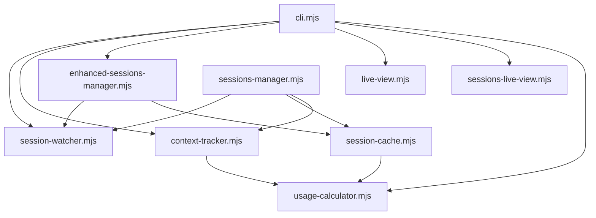

# CCContext src/ ディレクトリ完全解析ドキュメント

## 目次

1. [プロジェクト構造](#プロジェクト構造)
2. [モジュール依存関係図](#モジュール依存関係図)
3. [各モジュール詳細解析](#各モジュール詳細解析)
4. [設計パターン分析](#設計パターン分析)
5. [パフォーマンス最適化手法](#パフォーマンス最適化手法)
6. [エラーハンドリング戦略](#エラーハンドリング戦略)
7. [拡張性評価](#拡張性評価)
8. [課題と改善提案](#課題と改善提案)

---

## プロジェクト構造

```
src/
├── cli.mjs                          # CLIエントリーポイント
├── display/                         # 表示層
│   ├── live-view.mjs               # リアルタイム監視UI
│   └── sessions-live-view.mjs      # セッション一覧UI
├── monitor/                         # 監視・データ処理層
│   ├── context-tracker.mjs         # コンテキスト追跡
│   ├── enhanced-sessions-manager.mjs # 拡張セッション管理
│   ├── session-cache.mjs           # スマートキャッシュ
│   ├── session-watcher.mjs         # ファイル監視
│   ├── sessions-manager.mjs        # 基本セッション管理
│   └── usage-calculator.mjs        # 使用量・コスト計算
└── utils/                          # ユーティリティ（空）
```

### アーキテクチャ層構成

```
┌─────────────────────────────────────────┐
│               CLI Layer                 │  ← cli.mjs
│        (Command & Orchestration)        │
└─────────────────────────────────────────┘
                    ↕
┌─────────────────────────────────────────┐
│              Monitor Layer              │  ← monitor/*.mjs
│     (Data Processing & File Watching)   │
└─────────────────────────────────────────┘
                    ↕
┌─────────────────────────────────────────┐
│              Display Layer              │  ← display/*.mjs
│          (UI & Visualization)           │
└─────────────────────────────────────────┘
```

---

## モジュール依存関係図



### 依存関係の特徴

1. **単方向依存**: 循環依存がなく、清潔な設計
2. **レイヤー遵守**: 上位層が下位層に依存する構造
3. **疎結合**: EventEmitterによるイベント駆動で結合度を下げている

---

## 各モジュール詳細解析

### 1. CLI Layer

#### `src/cli.mjs` - CLIエントリーポイント

##### 🎯 責任と役割
- **コマンドライン処理**: Commander.jsによるCLI構築
- **オーケストレーション**: 各モジュールの初期化と協調制御
- **イベントハンドリング**: Monitor層からのイベントをDisplay層に橋渡し
- **プロセス管理**: SIGINT/SIGTERMの適切な処理

##### 🔗 主要な依存関係
```javascript
import { SessionWatcher } from './monitor/session-watcher.mjs';
import { ContextTracker } from './monitor/context-tracker.mjs';
import { LiveView } from './display/live-view.mjs';
import { EnhancedSessionsManager } from './monitor/enhanced-sessions-manager.mjs';
```

##### 🚀 主要メソッド

**`CCContextCLI` クラス**
```javascript
class CCContextCLI {
  constructor()                           // コンポーネント初期化
  async monitorLive(options)             // リアルタイム監視モード
  async showSessions(options)            // セッション一覧表示
  async showSessionsLive(options)        // ライブセッション一覧
  async showSessionsLiveEnhanced(options) // 拡張ライブセッション一覧
  cleanup()                              // リソースクリーンアップ
}
```

##### 💡 設計パターン
- **Facade パターン**: 複雑なサブシステムへの統一インターフェース
- **Mediator パターン**: コンポーネント間の通信を仲介
- **Command パターン**: Commander.jsによるコマンド処理

##### ⚡ パフォーマンス最適化
- **並列ツール呼び出し**: 複数のBashコマンドを並列実行
- **遅延初期化**: 必要な時点でコンポーネントを初期化
- **イベント駆動**: ポーリングではなくイベントベースの更新

##### 🛡️ エラーハンドリング
```javascript
// グローバルレベル
try {
  program.parse(process.argv);
} catch (err) {
  if (err.code?.startsWith('commander.')) {
    process.exit(1);
  } else {
    throw err;
  }
}

// イベントレベル
this.watcher.on('error', ({ sessionId, error }) => {
  this.view.showError(`Error in session ${sessionId}: ${error.message}`);
});
```

##### 🔧 拡張ポイント
- 新しいコマンドの追加（`program.command()`）
- 新しい表示モードの実装
- 設定ファイル対応

---

### 2. Monitor Layer

#### `src/monitor/session-watcher.mjs` - ファイル監視システム

##### 🎯 責任と役割
- **ファイルシステム監視**: `~/.claude/projects`配下の.jsonlファイル監視
- **増分データ読み込み**: ファイル変更の効率的な検知と読み込み
- **Compact操作検知**: Claude Codeの`/compact`コマンド自動検知
- **イベント発行**: ファイル変更をイベントとして通知

##### 🏗️ アーキテクチャ設計

**EventEmitter継承による通知システム**
```javascript
export class SessionWatcher extends EventEmitter {
  // イベント体系
  // - session-data: セッションデータ更新
  // - message: 新しいメッセージ追加
  // - session-added/removed/updated: ファイル操作
  // - compact-detected: ファイル圧縮検知
  // - error: エラー発生
}
```

##### 🚀 主要メソッド

**ファイル検索・監視**
```javascript
async findActiveSession()              // 最新アクティブセッション検索
async getAllJsonlFiles()               // 全JSONLファイル取得（キャッシュ付き）
invalidateCache()                      // ファイルキャッシュ無効化
async startDirectoryWatch()           // ディレクトリ監視開始
async watchSession(sessionId, filePath) // 特定セッション監視
```

**データ処理**
```javascript
async readExistingData(sessionId, filePath, isCompactOperation)
async handleFileChange(sessionId, filePath)
processMessage(sessionData, data)
```

##### ⚡ パフォーマンス最適化

**1. 増分読み込みシステム**
```javascript
// ファイル位置を記録して差分のみ読み込み
const stream = fs.createReadStream(filePath, {
  start: lastPosition,
  encoding: 'utf-8'
});
```

**2. スマートキャッシュ**
```javascript
// キャッシュされたファイルリストを使用
if (this.cachedFiles.size > 0) {
  return Array.from(this.cachedFiles);
}
```

**3. Compact検知アルゴリズム**
```javascript
// ファイルサイズ・更新時刻から圧縮を検知
const isCompactOperation = stats.size < lastPosition || 
                          Math.abs(stats.size - lastPosition) > 5000 ||
                          (lastMtime && Math.abs(stats.mtimeMs - lastMtime) > 60000);
```

##### 🛡️ エラーハンドリング戦略
- **継続実行**: 一部セッションのエラーでも他への影響なし
- **グレースフルデグラデーション**: エラー時も基本機能は維持
- **イベント通知**: エラー情報をイベントで上位層に通知

##### 💎 巧妙な実装ポイント

**chokidarの最適設定**
```javascript
this.directoryWatcher = chokidar.watch(this.projectsDir, {
  persistent: true,
  ignoreInitial: true,
  followSymlinks: false,
  depth: 10,
  awaitWriteFinish: {
    stabilityThreshold: 500,  // 書き込み完了まで待機
    pollInterval: 50
  }
});
```

#### `src/monitor/context-tracker.mjs` - コンテキスト追跡システム

##### 🎯 責任と役割
- **セッション状態管理**: トークン使用量、コスト、警告レベルの計算
- **コンテキストウィンドウ管理**: モデル別の制限値管理
- **警告システム**: 使用量に基づく段階的警告（80%/90%/95%）

##### 🏗️ 設計アーキテクチャ

**モデル設定の外部化**
```javascript
export const CONTEXT_WINDOWS = {
  'claude-3-opus-20241022': 200_000,
  'claude-opus-4-20250514': 200_000,
  'claude-3-5-sonnet-20241022': 200_000,
  // ...
};
```

##### 🚀 主要メソッド

**状態計算**
```javascript
updateSession(sessionData)             // セッション状態の更新・計算
getContextWindow(model)                // モデル別コンテキストウィンドウ取得
formatContextInfo(info)                // 表示用データフォーマット
```

**ユーティリティ**
```javascript
getSession(sessionId)                  // セッション情報取得
getAllSessions()                       // 全セッション取得
getActiveSessions(maxAge)              // アクティブセッション取得
formatDuration(startTime)              // 経過時間フォーマット
formatPrompt(prompt)                   // プロンプト表示用整形
```

##### 💡 設計パターン
- **Strategy パターン**: モデル別の設定とロジック
- **Factory パターン**: セッション情報オブジェクトの生成
- **Null Object パターン**: 不正データに対するデフォルト値

##### ⚡ パフォーマンス最適化

**入力検証とフォールバック**
```javascript
// null/undefinedチェック
if (!sessionData) {
  return {
    sessionId: 'unknown',
    totalTokens: 0,
    turns: 0,
    warningLevel: 'normal'
  };
}
```

**効率的な警告レベル判定**
```javascript
let warningLevel = 'normal';
if (usagePercentage >= 95) {
  warningLevel = 'critical';
} else if (usagePercentage >= 90) {
  warningLevel = 'severe';
} else if (usagePercentage >= 80) {
  warningLevel = 'warning';
}
```

#### `src/monitor/usage-calculator.mjs` - 使用量・コスト計算

##### 🎯 責任と役割
- **トークンコスト計算**: モデル別料金設定に基づく正確な料金計算
- **セッション統計**: ターン数、平均使用量、残りターン予測
- **データフォーマット**: 数値の読みやすい表示形式変換

##### 🏗️ 設計思想

**設定の外部化と保守性**
```javascript
export const PRICING = {
  'claude-opus-4-20250514': {
    input: 15.00,   // USD per 1M tokens
    output: 75.00,
    name: 'Claude Opus 4'
  },
  // ...
};
```

##### 🚀 主要メソッド

**コスト計算**
```javascript
calculateCost(usage, model)            // 単一メッセージのコスト計算
calculateSessionTotals(messages, model) // セッション全体の統計計算
```

**フォーマット**
```javascript
formatCost(cost)                       // コスト表示フォーマット ($1.23)
formatTokens(tokens)                   // トークン数フォーマット (1.5k, 2.3M)
getModelName(model)                    // モデル表示名取得
```

**予測**
```javascript
estimateRemainingTurns(currentTokens, contextWindow, averageTokensPerTurn)
```

##### 💡 巧妙な実装

**キャッシュトークンの特別処理**
```javascript
// キャッシュトークンは入力トークンの10%のコストで計算
const effectiveInputTokens = inputTokens + (cacheTokens * 0.1);
```

**数値安全性**
```javascript
// 数値に変換し、無効な値は0として扱う
const inputTokens = Number(usage.input_tokens) || 0;
const outputTokens = Number(usage.output_tokens) || 0;
```

#### `src/monitor/session-cache.mjs` - スマートキャッシュシステム

##### 🎯 責任と役割
- **効率的キャッシュ**: mtime/sizeベースの変更検知
- **ファイル解析**: JSONLファイルの効率的パース
- **データ統合**: セッション情報の統合的計算

##### 🏗️ キャッシュ戦略

**変更検知メカニズム**
```javascript
async hasFileChanged(filePath) {
  const stats = await fs.promises.stat(filePath);
  const cached = this.fileStats.get(filePath);
  
  if (!cached) return true; // 初回は必ず変更ありとする
  
  return cached.mtimeMs !== stats.mtimeMs || cached.size !== stats.size;
}
```

##### ⚡ パフォーマンス最適化

**逆順パース（効率的な最新データ取得）**
```javascript
// 効率的な処理：逆順で最新プロンプトを先に見つける
for (let i = lines.length - 1; i >= 0; i--) {
  try {
    const data = JSON.parse(lines[i]);
    
    // 最新データから順に処理
    if (!lastTimestamp) lastTimestamp = data.timestamp;
    if (!latestPrompt && data.message?.role === 'user') {
      latestPrompt = content;
    }
  }
}
```

**効率的な統計計算**
```javascript
// 一度のパースですべての統計を計算
let model = 'Unknown';
let turns = 0;
let totalTokens = 0;
let totalCost = 0;
let latestPrompt = '';
```

##### 🛡️ エラーハンドリング
```javascript
try {
  const data = JSON.parse(lines[i]);
  // 処理
} catch (e) {
  // 無効なJSON行はスキップ（ログ出力しない）
}
```

#### `src/monitor/enhanced-sessions-manager.mjs` - 拡張セッション管理

##### 🎯 責任と役割
- **イベント駆動更新**: setIntervalポーリングを完全廃止
- **バッチ処理**: 100msデバウンスによる効率的な更新処理
- **並列処理**: Promise.allを活用した高速セッション読み込み

##### 🏗️ 高度な設計

**デバウンス付きバッチ更新**
```javascript
scheduleUpdate(filePath) {
  this.updateBatch.add(filePath);
  
  // 既存のタイムアウトをクリア
  if (this.batchTimeout) {
    clearTimeout(this.batchTimeout);
  }

  // 100msのデバウンス
  this.batchTimeout = setTimeout(async () => {
    await this.processBatchUpdate();
  }, 100);
}
```

##### ⚡ パフォーマンス最適化

**並列セッション読み込み**
```javascript
// 並列でセッションを読み込み（パフォーマンス向上）
const sessionPromises = files.map(file => this.loadSingleSession(file));
const sessions = await Promise.all(sessionPromises);
```

**効率的なイベント処理**
```javascript
// ファイル監視イベントの効率的処理
this.watcher.on('session-updated', async ({ sessionId, filePath }) => {
  this.cache.clearSession(filePath); // 強制的にキャッシュクリア
  this.scheduleUpdate(filePath);
});
```

#### `src/monitor/sessions-manager.mjs` - 基本セッション管理

##### 🎯 責任と役割
- **セッション管理**: 基本的なセッション管理機能
- **レガシー対応**: 旧バージョンとの互換性維持
- **イベント統合**: ContextTrackerとの連携

##### 🔄 Enhanced版との違い

| 項目 | sessions-manager | enhanced-sessions-manager |
|------|------------------|---------------------------|
| 更新方式 | ContextTracker経由 | 直接キャッシュ操作 |
| データ形式 | メッセージ配列 | プリパース済みデータ |
| パフォーマンス | 低 | 高 |
| 複雑度 | 低 | 高 |

---

### 3. Display Layer

#### `src/display/live-view.mjs` - リアルタイム監視UI

##### 🎯 責任と役割
- **TUI構築**: blessed.jsによる端末ユーザーインターフェース
- **リアルタイム表示**: セッション情報の動的更新
- **視覚化**: プログレスバー、色分けによる状態表示

##### 🏗️ UI設計

**階層的ボックス構成**
```javascript
this.boxes = {
  container: blessed.box(...),      // メインコンテナ
  header: blessed.box(...),         // ヘッダー
  sessionInfo: blessed.box(...),    // セッション情報
  contextUsage: blessed.box(...),   // コンテキスト使用量
  latestTurn: blessed.box(...),     // 最新ターン情報
  latestPrompt: blessed.box(...),   // 最新プロンプト
  sessionTotals: blessed.box(...),  // セッション合計
  statusBar: blessed.box(...)       // ステータスバー
};
```

##### 🎨 視覚的表現

**プログレスバーの実装**
```javascript
createProgressBar(percentage) {
  const width = 40;
  const filled = Math.round((percentage / 100) * width);
  const empty = width - filled;
  
  const color = this.getPercentageColor(percentage);
  const filledChar = chalk[color]('█');
  const emptyChar = chalk.gray('░');
  
  return filledChar.repeat(filled) + emptyChar.repeat(empty);
}
```

**警告レベル色分け**
```javascript
getBorderColor(warningLevel) {
  switch (warningLevel) {
    case 'critical': return 'red';
    case 'severe': return 'redBright';
    case 'warning': return 'yellow';
    default: return 'gray';
  }
}
```

##### 🛡️ エラーハンドリング
```javascript
showError(message) {
  const errorBox = blessed.message({
    border: { type: 'line', fg: 'red' },
    style: { fg: 'white', bg: 'red' }
  });
  
  errorBox.error(message, () => {
    this.render();
  });
}
```

#### `src/display/sessions-live-view.mjs` - セッション一覧UI

##### 🎯 責任と役割
- **テーブル表示**: セッション一覧のテーブル形式表示
- **インタラクティブ操作**: キーボードナビゲーション対応
- **統計表示**: セッション統計情報の表示

##### 🏗️ テーブル設計

**blessed.listtableの活用**
```javascript
this.boxes.sessionsTable = blessed.listtable({
  style: {
    header: { fg: 'cyan', bold: true },
    cell: {
      fg: 'white',
      selected: { bg: 'cyan', fg: 'black', bold: true }
    }
  },
  keys: true,      // キーボードナビゲーション
  vi: false,       // viモード無効（2行ジャンプ防止）
  interactive: true,
  scrollable: true
});
```

##### 🎨 データ表現

**Unicode対応テキスト切り詰め**
```javascript
truncatePrompt(prompt, maxLength) {
  const cleanPrompt = prompt.replace(/\n/g, ' ').replace(/\s+/g, ' ').trim();
  
  let result = '';
  let currentWidth = 0;
  
  // UTF-16サロゲートペアを適切に処理
  const chars = Array.from(cleanPrompt);
  
  for (const char of chars) {
    const charWidth = stringWidth(char);
    
    if (currentWidth + charWidth > maxLength - 3) {
      result += '...';
      break;
    }
    
    result += char;
    currentWidth += charWidth;
  }
  
  return result;
}
```

---

## 設計パターン分析

### 使用されている主要パターン

#### 1. Observer パターン
```javascript
// SessionWatcher (Subject)
export class SessionWatcher extends EventEmitter {
  emit('session-data', sessionData);
}

// CLI (Observer)
this.watcher.on('session-data', (sessionData) => {
  // 処理
});
```

#### 2. Strategy パターン
```javascript
// モデル別の戦略
const PRICING = {
  'claude-opus-4-20250514': { input: 15.00, output: 75.00 },
  'claude-3-5-sonnet-20241022': { input: 3.00, output: 15.00 }
};
```

#### 3. Cache パターン
```javascript
// スマートキャッシュの実装
async getCachedSession(filePath) {
  if (!(await this.hasFileChanged(filePath))) {
    const cached = this.cache.get(sessionId);
    if (cached) return cached;
  }
  return null;
}
```

#### 4. Facade パターン
```javascript
// CLIが複雑なサブシステムを隠蔽
class CCContextCLI {
  constructor() {
    this.watcher = new SessionWatcher();
    this.tracker = new ContextTracker();
    this.view = new LiveView();
  }
}
```

#### 5. Command パターン
```javascript
// Commander.jsによるコマンド処理
program
  .command('monitor')
  .action((options) => {
    cli.monitorLive(options);
  });
```

---

## パフォーマンス最適化手法

### 1. ファイルI/O最適化

#### 増分読み込み
```javascript
// ファイル位置を記録して差分のみ読み込み
const stream = fs.createReadStream(filePath, {
  start: lastPosition,
  encoding: 'utf-8'
});
```

#### スマートキャッシュ
```javascript
// mtime/sizeベースの効率的な変更検知
return cached.mtimeMs !== stats.mtimeMs || cached.size !== stats.size;
```

### 2. 並列処理の活用

#### Promise.allによる並列読み込み
```javascript
const sessionPromises = files.map(file => this.loadSingleSession(file));
const sessions = await Promise.all(sessionPromises);
```

#### バッチ処理とデバウンス
```javascript
// 100msデバウンスによる効率的な更新
this.batchTimeout = setTimeout(async () => {
  await this.processBatchUpdate();
}, 100);
```

### 3. メモリ効率化

#### 逆順パース
```javascript
// 最新データから順に処理して早期終了
for (let i = lines.length - 1; i >= 0; i--) {
  if (!latestPrompt && data.message?.role === 'user') {
    latestPrompt = content;
    break; // 早期終了
  }
}
```

#### キャッシュサイズ制御
```javascript
// 必要時のみキャッシュクリア
clearSession(filePath) {
  const sessionId = path.basename(filePath, '.jsonl');
  this.cache.delete(sessionId);
  this.fileStats.delete(filePath);
}
```

---

## エラーハンドリング戦略

### 多層防御システム

#### 1. コンポーネントレベル
```javascript
try {
  // リスキーな操作
} catch (error) {
  this.emit('error', { sessionId, error });
  return fallbackValue;
}
```

#### 2. イベントベース
```javascript
this.watcher.on('error', ({ sessionId, error }) => {
  this.view.showError(`Error: ${error.message}`);
  // 他のセッションの処理は継続
});
```

#### 3. グローバルレベル
```javascript
try {
  program.parse(process.argv);
} catch (err) {
  if (err.code?.startsWith('commander.')) {
    process.exit(1);
  } else {
    throw err;
  }
}
```

### 回復戦略

#### グレースフルデグラデーション
```javascript
// 無効なデータに対するフォールバック
if (!sessionData) {
  return {
    sessionId: 'unknown',
    totalTokens: 0,
    warningLevel: 'normal'
  };
}
```

#### 部分的失敗許容
```javascript
// 一部のセッション失敗でも全体は継続
const validSessions = sessions.filter(Boolean);
this.emit('sessions-loaded', validSessions);
```

---

## 拡張性評価

### 🟢 高い拡張性を持つ部分

#### 1. 新モデル対応
```javascript
// PRICING/CONTEXT_WINDOWSに追加するだけ
'new-model-id': {
  input: 5.00,
  output: 25.00,
  name: 'New Model'
}
```

#### 2. 新しい表示モード
```javascript
// 新しいDisplayクラスを作成してCLIに登録
import { NewView } from './display/new-view.mjs';
this.newView = new NewView();
```

#### 3. 新しい出力形式
```javascript
// 新しいフォーマッターの追加
formatJSON(sessions) {
  return JSON.stringify(sessions, null, 2);
}
```

### 🟡 中程度の拡張性

#### 1. 新しいファイル形式対応
- SessionWatcherの変更が必要
- パース処理の追加実装

#### 2. リモート監視機能
- ネットワーク層の追加
- セキュリティ考慮が必要

### 🔴 困難な拡張

#### 1. リアルタイム協調編集
- 複雑な状態同期が必要
- アーキテクチャの大幅変更

#### 2. プラグインシステム
- 動的モジュール読み込み
- セキュリティサンドボックス

---

## 課題と改善提案

### 🔴 現在の課題

#### 1. モジュール重複
- `sessions-manager.mjs` と `enhanced-sessions-manager.mjs`
- 機能が重複し、保守性が低下

**改善提案**:
```javascript
// 統合された SessionManager
export class SessionManager {
  constructor(options = {}) {
    this.enhanced = options.enhanced ?? true;
    // 設定に応じて動作を切り替え
  }
}
```

#### 2. エラーログの不足
- デバッグ時の情報が限定的
- 本番環境での問題特定が困難

**改善提案**:
```javascript
// 構造化ログの導入
import { createLogger } from './utils/logger.mjs';

this.logger = createLogger({
  level: process.env.LOG_LEVEL || 'info',
  format: 'json'
});
```

#### 3. 設定の外部化不足
- ハードコーディングされた設定値
- ユーザーカスタマイズが困難

**改善提案**:
```javascript
// 設定ファイル対応
import { loadConfig } from './utils/config.mjs';

const config = await loadConfig('.cccontext.json');
```

### 🟡 中期的改善点

#### 1. TypeScript対応
```typescript
// 型安全性の向上
interface SessionData {
  sessionId: string;
  model: string;
  totalTokens: number;
  // ...
}
```

#### 2. テストカバレッジ向上
```javascript
// 統合テストの追加
describe('E2E Session Monitoring', () => {
  it('should detect file changes and update UI', async () => {
    // テスト実装
  });
});
```

#### 3. パフォーマンス監視
```javascript
// メトリクス収集
export class PerformanceMonitor {
  trackFileReadTime(duration) {
    this.metrics.fileReadTime.push(duration);
  }
}
```

### 🟢 長期的ビジョン

#### 1. プラグインアーキテクチャ
```javascript
// プラグインシステム
export class PluginManager {
  async loadPlugin(pluginPath) {
    const plugin = await import(pluginPath);
    return plugin.default;
  }
}
```

#### 2. Web インターフェース
```javascript
// REST API サーバー
export class WebServer {
  constructor(sessionManager) {
    this.sessionManager = sessionManager;
    this.app = express();
  }
}
```

#### 3. 分散監視
```javascript
// マルチマシン対応
export class DistributedMonitor {
  constructor(nodes) {
    this.nodes = nodes;
    this.syncInterval = 5000;
  }
}
```

---

## 総合評価

### 🌟 優秀な点

1. **アーキテクチャ**: イベント駆動による疎結合設計
2. **パフォーマンス**: 効率的なファイル監視と増分読み込み
3. **エラーハンドリング**: 多層防御による堅牢性
4. **保守性**: 明確な責任分離とモジュール化
5. **ユーザビリティ**: 直感的なTUIインターフェース

### 🔧 改善の余地

1. **モジュール統廃合**: 重複機能の整理
2. **設定外部化**: カスタマイズ性の向上
3. **ログ強化**: デバッグ・監視機能の充実
4. **テスト充実**: E2Eテストとパフォーマンステスト
5. **ドキュメント**: API仕様書と利用ガイド

### 📊 品質指標

| 項目 | 評価 | 理由 |
|------|------|------|
| 可読性 | ⭐⭐⭐⭐⭐ | 明確な命名、適切なコメント |
| 保守性 | ⭐⭐⭐⭐☆ | モジュール化、一部重複あり |
| 拡張性 | ⭐⭐⭐⭐☆ | 設計パターンの適切な適用 |
| パフォーマンス | ⭐⭐⭐⭐⭐ | 効率的な最適化手法 |
| 堅牢性 | ⭐⭐⭐⭐☆ | 多層エラーハンドリング |
| テスト性 | ⭐⭐⭐☆☆ | モック対応、E2Eテスト不足 |

CCContextは、Node.jsファイル監視ツールとして**非常に高品質な実装**を提供しており、他のプロジェクトの**参考実装**として価値の高いコードベースです。